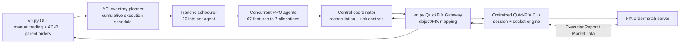

# vn.py + optimized QuickFIX + AC-RL execution

## Project overview

This project builds an end-to-end algorithmic execution prototype on top of
vn.py and a customized QuickFIX C++ engine. Its main goal is to execute a large
sell parent order within a specified horizon while separating two decisions:

- **Macro execution planning:** an Almgren-Chriss (AC) inventory curve determines
  how quickly the parent inventory should be reduced over time.
- **Micro execution tactics:** PPO agents decide how each 20-lot tranche should
  be distributed among an immediately marketable order, five passive price
  levels, and inactive inventory.

A central coordinator allows multiple agents to operate concurrently without
letting them send orders independently. It reconciles desired allocations with
live child orders, tracks fills and pending cancellations, enforces parent/tranche
volume limits, and applies deadline fallback. The resulting vn.py orders are
translated into FIX 4.2 messages and transmitted through the QuickFIX C++ session
and socket layers to the ordermatch server.



### Technical highlights

- **QuickFIX C++ optimization:** adds SSE2 16-byte stream scanning, specialized
  fixed-layout parsing for high-frequency order/cancel/market-data templates,
  and switchable Busy-Poll/Direct Socket paths. In a local 200,000-message
  NewOrderSingle benchmark, Busy-Poll increased throughput from 136,046 to
  175,173 messages/s (+28.8%) and reduced voluntary context switches by 99.4%.
- **RL tactical execution:** trains a PPO Actor-Critic policy for a 20-lot,
  150-simulation-unit task using 200,000 decision samples. The deployed policy
  maps a locked 67-dimensional order-book/order-flow state to seven inventory
  allocation targets; in 200 paired simulations it achieved a +1.3715 mean
  reward advantage and a 97.5% win rate against Market-TWAP.
- **AC-RL multi-agent framework:** converts an arbitrary parent order in multiples
  of 20 lots into deadline-aware RL tranches. For example, a 260-lot/120-second
  schedule creates 13 agents with a required peak concurrency of four, while the
  coordinator handles asynchronous fills, cancel races, overfill prevention,
  pause/resume/cancel operations, and deadline completion.
- **Full trading path:** preserves vn.py's manual order, cancellation, and market
  subscription functions while adding an AC-RL GUI. Both manual and algorithmic
  orders pass through the same `MainEngine -> QuickfixGateway -> QuickFIX C++`
  path, with ExecutionReport and market-data callbacks returned to vn.py.

This repository is a research and systems-integration prototype. The bundled
ordermatch market data is deterministic test data, and the RL results above are
simulation results rather than evidence of live-trading performance. Generated
binaries, FIX session state, logs, credentials, and training caches are
intentionally excluded from the snapshot.

## Demo

[Watch the order execution demo (MP4, 3:01, 8.6 MiB)](./Order_Execution_Demo_web.mp4)

## Repository layout

```text
QuickFIX/                 Customized QuickFIX C++ engine and ordermatch server
rlte/                     RL training, evaluation, deployment contract, and model
vnpy/                     Pinned vn.py source snapshot
vnpy_quickfix_gateway/    vn.py FIX gateway, mappings, configs, and tests
vnpy_acrl_execution/      AC planner, RL tranches, coordinator, and GUI App
scripts/                  Portable preparation and launch scripts
```

The two Python integration packages remain editable installations. The original
vn.py Trading panel still supports manual orders, cancellations, and subscriptions;
the AC-RL window adds parent-order execution through the same QuickFIX gateway.

## Environment and installation

Run commands from the repository root. Create the environment:

```bash
conda env create -f environment.yml
conda activate vnpyfix
```

Build the customized QuickFIX engine, Python binding, examples, and tests:

```bash
cmake -S QuickFIX -B QuickFIX/build-conda-full \
  -DCMAKE_BUILD_TYPE=Release \
  -DCMAKE_INSTALL_PREFIX="$CONDA_PREFIX" \
  -DHAVE_SSL=ON \
  -DHAVE_PYTHON3=ON \
  -DQUICKFIX_EXAMPLES=ON \
  -DQUICKFIX_TESTS=ON \
  -DQUICKFIX_SIMD_STREAM_PARSER=ON \
  -DQUICKFIX_SIMD_PATTERN_SCAN=ON \
  -DQUICKFIX_FIXED_LAYOUT_PARSER=ON \
  -DQUICKFIX_BUSY_POLL=ON \
  -DQUICKFIX_DIRECT_READ_POLL=ON
cmake --build QuickFIX/build-conda-full --parallel 2
cmake --install QuickFIX/build-conda-full
```

Expose the installed binding in the active shell, then install the Python
projects in editable mode:

```bash
export LD_LIBRARY_PATH="$CONDA_PREFIX/lib:${LD_LIBRARY_PATH:-}"
export PYTHONPATH="$CONDA_PREFIX/lib/python3:${PYTHONPATH:-}"

python -m pip install -e ./vnpy
python -m pip install -e ./vnpy_quickfix_gateway --no-deps --no-build-isolation
python -m pip install -e ./vnpy_acrl_execution --no-deps --no-build-isolation
python -c "import quickfix, vnpy, vnpy_quickfix_gateway, vnpy_acrl_execution; print('imports ok')"
```

For persistent activation, place the two exports in conda's `activate.d`
directory rather than committing a machine-specific path to this repository.

## Running the system

Prepare ignored runtime directories:

```bash
./scripts/prepare_runtime.sh
```

Start the optimized C++ ordermatch server in terminal 1:

```bash
conda activate vnpyfix
./scripts/run_ordermatch.sh
```

Start the unified vn.py GUI and connect in terminal 2:

```bash
conda activate vnpyfix
./scripts/run_trader.sh --connect
```

After `[FIX] onLogon` appears, manual functions are available in the standard
Trading panel. Open `App -> AC-RL Execution` for the parent-order interface.
See `vnpy_acrl_execution/README.md` for the 20-lot smoke test, 260-lot scheduling
example, model contract, and known market-data limitations.

## Verification

```bash
pytest -q vnpy_quickfix_gateway/tests
pytest -q vnpy_acrl_execution/tests
pytest -q rlte/tests --ignore=rlte/tests/test_market_direction.py
python -m vnpy_acrl_execution.logic_demo \
  --volume 260 --seconds 120 --rl-horizon 30 --max-active 4
```

The ignored RLTE file is a legacy standalone multiprocessing script that imports
an upstream `advanced_multi_lot` module absent from both the original checkout
and this snapshot; it is not part of the deployed policy test suite.

Snapshot verification on 2026-09-02 completed with 2 Gateway tests, 26 AC-RL
tests, and 14 RLTE deployment/training tests passing.

With ordermatch running, the real FIX-path smoke test is:

```bash
python -m vnpy_acrl_execution.fix_smoke
```

Success ends with `status=COMPLETED traded=20/20` and `[SMOKE] PASS`.

## Source and licensing

Exact source revisions, model checksum, copied working-tree state, and excluded
artifacts are recorded in `SOURCE_VERSIONS.md`. Third-party code remains governed
by its own license. QuickFIX and vn.py license files are retained in their source
directories.

The upstream RLTE snapshot does not contain a license file. Do not make this
monorepo public until redistribution permission or an applicable license has been
confirmed with the RLTE author. A private GitHub repository is the safe default.
